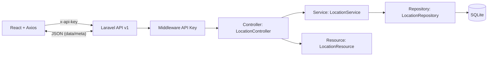
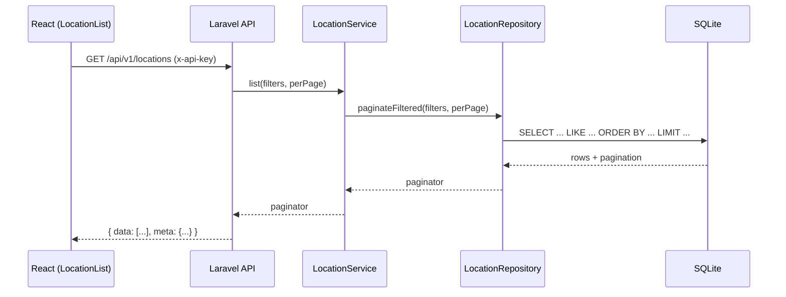

# gestor_sedes

> Prueba Técnica Full Stack (Laravel 12, React, TypeScript) — **Windows + VSCode + XAMPP**  
> **Backend**: Laravel 12 + SQLite + API Key // **Frontend**: Vite + React + TS + MUI

---

## ✅ Entregables (orden solicitado)

### a) Requisitos y configuración de entorno

**Windows** con:
- PHP ≥ 8.2 (XAMPP/CLI), Composer
- Node.js ≥ 18 (recomendado 20), npm
- Git, VSCode
- (Opcional) Docker Desktop

**Claves y variables:**

- **Backend (`/backend/.env`)**
  ```env
  APP_NAME=gestor_sedes
  APP_ENV=local
  APP_KEY=
  APP_DEBUG=true
  APP_URL=http://127.0.0.1:8000

  # Base de datos SQLite
  DB_CONNECTION=sqlite
  DB_DATABASE=database/database.sqlite

  # API (consumida por el frontend)
  API_KEY=sk_local_xxxxxxxxxxxxxxxxxxxxxxxxxxxxxxxxxxxxxxxxxxxxxxxxxxxxxxxxxxxx
  API_RATE_LIMIT=60
  API_CACHE_TTL=30
  ```

- **Backend (tests) — `/backend/.env.testing`**
  ```env
  APP_ENV=testing
  APP_DEBUG=true
  APP_KEY=base64:AAAAAAAAAAAAAAAAAAAAAAAAAAAAAAAAAAAAAAAAAAA=

  DB_CONNECTION=sqlite
  DB_DATABASE=:memory:

  API_KEY=sk_local_xxxxxxxxxxxxxxxxxxxxxxxxxxxxxxxxxxxxxxxxxxxxxxxxxxxxxxxxxxxx
  API_RATE_LIMIT=60
  API_CACHE_TTL=1
  ```

- **Frontend (`/frontend/.env`)**
  ```env
  VITE_API_BASE_URL=http://127.0.0.1:8000/api
  VITE_API_KEY=sk_local_xxxxxxxxxxxxxxxxxxxxxxxxxxxxxxxxxxxxxxxxxxxxxxxxxxxxxxxxxxxx
  ```

> **Generar APP_KEY**: `cd backend` → `php artisan key:generate`  
> **Crear BD**: `mkdir backend\database` y `ni backend\database\database.sqlite -ItemType File` (PowerShell).

---

### b) Comandos para levantar backend y frontend

**PowerShell 5.1 (sin `&&`)**

**Backend**
```powershell
cd backend
composer install
php artisan migrate --seed
php artisan serve
# http://127.0.0.1:8000
```

**Frontend**
```powershell
cd frontend
npm i
npm run dev
# http://127.0.0.1:5173
```

> También existen scripts: `scripts/start-backend.ps1` y `scripts/start-frontend.ps1` (Windows).

**Docker (opcional)**
```powershell
# Instalar deps backend con Composer en contenedor
docker compose run --rm composer

# Crear BD sqlite si no existe
cd backend
mkdir database 2>$null
ni database\database.sqlite -ItemType File

# Levantar servicios
cd ..
docker compose up backend frontend
# Backend: http://localhost:8000  // Frontend: http://localhost:5173
```

---

### c) Uso de API Key y rutas versionadas

- El **middleware** exige header: `x-api-key: <tu_api_key>`
- Las rutas están **versionadas**: `/api/v1`

**Endpoints**:

- `GET /api/v1/locations`
  - **Query**: `name` (like), `code` (like), `page`, `per_page`
  - **Respuesta** (paginada con `data[]` y `meta`)

- `POST /api/v1/locations`
  - **Body**:
    ```json
    { "code": "BOG", "name": "Bogotá", "image": "https://..." }
    ```
  - **Validación**: `code` requerido/único, `name` requerido, `image` opcional
  - **Respuesta**: `data` con la entidad creada

**Ejemplos**
```bash
# GET (filtrado por name=bo)
curl "http://127.0.0.1:8000/api/v1/locations?name=bo" -H "x-api-key: <tu_api_key>"

# POST
curl -X POST "http://127.0.0.1:8000/api/v1/locations" \
  -H "x-api-key: <tu_api_key>" -H "Content-Type: application/json" \
  -d '{"code":"ABC","name":"Ciudad ABC"}'
```

**Formato de errores**
```json
{ "error": { "message": "Invalid parameters", "code": "E_INVALID_PARAM", "details": { ... } } }
```

---

### d) Cómo correr los tests

**Backend**
```powershell
cd backend
php artisan migrate:fresh --seed
composer test      # o: php artisan test
composer lint      # Laravel Pint
composer phpstan   # análisis estático
```

**Frontend**
```powershell
cd frontend
npm test -- --watch=false
npm run lint
```

*(Cobertura opcional — requiere Xdebug/PCOV para PHP y configuración Jest con coverage)*

---

## Estructura del repositorio

```
gestor_sedes/
├─ backend/                 # Laravel 12
│  ├─ app/
│  │  ├─ Http/
│  │  │  ├─ Controllers/Api/V1/LocationController.php
│  │  │  ├─ Middleware/ApiKeyMiddleware.php         # alias en bootstrap/app.php (L12)
│  │  │  └─ Requests/Location{Index,Store}Request.php
│  │  ├─ Providers/AppServiceProvider.php           # rate limiting por API Key
│  │  ├─ Repositories/LocationRepository.php
│  │  ├─ Services/LocationService.php
│  │  └─ Http/Resources/LocationResource.php        # DTO de salida
│  ├─ bootstrap/app.php                             # alias middleware + CORS + errores JSON
│  ├─ config/api.php                                
│  ├─ database/
│  │  ├─ factories/LocationFactory.php
│  │  ├─ migrations/xxxx_create_locations_table.php
│  │  └─ seeders/{DatabaseSeeder,LocationSeeder}.php
│  ├─ routes/api.php (v1)
│  ├─ tests/Feature/*.php, tests/Unit/*.php
│  ├─ composer.json (scripts: test, lint, phpstan, fix)
│  └─ phpstan.neon, pint.json, phpunit.xml
├─ frontend/                # Vite + React + TS + MUI
│  ├─ src/components/{LocationList,LocationForm,LocationCard}.tsx
│  ├─ src/lib/api.ts        # Axios con header x-api-key
│  ├─ src/types/*
│  ├─ src/__tests__/*.test.tsx
│  ├─ jest.config.{cjs,ts} + jest.setup.ts + tsconfig.test.json
│  └─ eslint.config.js, tsconfig.json, vite.config.ts
├─ scripts/                 # utilidades Windows
│  ├─ start-backend.ps1
│  └─ start-frontend.ps1
├─ docs/
│  └─ screenshots/          # (opcional) imágenes para README
├─ .github/workflows/ci.yml # CI: lint + tests backend/frontend
├─ docker-compose.yml       # (opcional) compose simple
├─ CHANGELOG.md             # SemVer + Conventional Commits
└─ README.md
```

---

## Arquitectura y decisiones

- **Versionado API**: `/api/v1` (fácil de evolucionar).
- **Seguridad**: API Key en header `x-api-key` (middleware alias en `bootstrap/app.php` — L12).
- **Rate limiting**: por API Key, configurado en `AppServiceProvider`.
- **Validaciones**: Form Requests + sanitización (trim, upper).
- **Capa de dominio**: Controller → Service → Repository (DI).
- **Salida**: `LocationResource` (DTO consistente).
- **Errores JSON**: unificados en `bootstrap/app.php`.
- **Cache**: listados con `Cache::remember(...)` (TTL configurado).
- **Frontend**: Axios con interceptor de errores, MUI, Zod, componentes desacoplados.

**Diagrama (Mermaid)**


**Secuencia GET /locations**


---

## CI/CD

Se incluye **GitHub Actions** en `.github/workflows/ci.yml` con:
- **Backend**: Composer cache, Pint, PHPStan, PHPUnit (con cobertura).
- **Frontend**: Node cache, ESLint, Jest (con cobertura).
- Artifacts: cobertura subidos por job.

---

## Versionado y Convenciones

- **SemVer** (`MAJOR.MINOR.PATCH`)
- **Conventional Commits**:
  - `feat:`, `fix:`, `docs:`, `refactor:`, `test:`, `chore:`
  - `feat!: ...` para cambios incompatibles
  - `BREAKING CHANGE: ...` en el cuerpo si aplica

Ejemplo:
```
feat(api): add filters for locations by code
test(frontend): add error state test in LocationList
chore(ci): upload coverage artifacts
```

---

## Changelog (resumen)

- **v0.1.0** — Estructura inicial, API v1 con endpoints de `locations`, validaciones, middleware API Key, rate limiting, cache, tests backend y frontend, CI propuesto.
- **v0.1.1** — Fixes de Pint/PHPStan, seeders idempotentes, factories, ajustes en tests (PHPUnit/Jest), docs y Mermaid.

> Ver también `CHANGELOG.md` para el historial completo.
