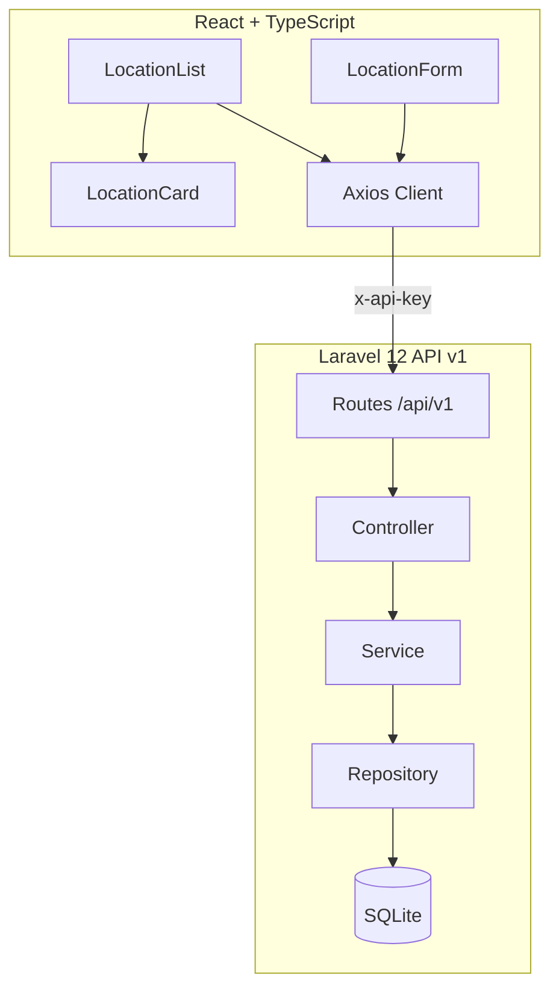
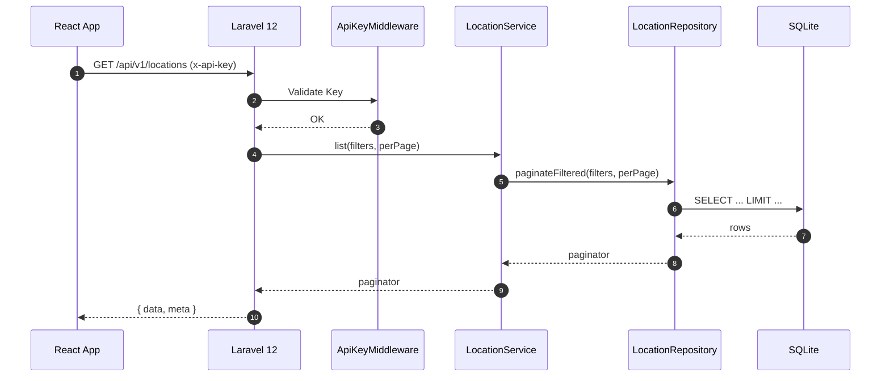

# gestor_sedes — Prueba Full Stack (Laravel 12 + React + TypeScript)

Monorepo para la **Prueba Técnica Full Stack** con **Laravel 12** (API REST con SQLite, API Key, rate limiting, manejo uniforme de errores, Resources, capa Service/Repository) y **React + TypeScript** (Vite, MUI, Axios, validaciones con Zod), incluyendo **linters**, **tests**, **CI en GitHub Actions** y documentación para **Windows + VSCode + XAMPP**.

> **Importante (Laravel 12):** el *middleware* **no** se registra en `Http/Kernel.php` (ya no se usa).  
> En **Laravel 12** se registran *aliases* de *middlewares* y excepciones en `bootstrap/app.php` con `->withMiddleware()->alias(...)` y `->withExceptions(...)`.

---

## Tabla de Contenido
- [Descripción y objetivos](#descripción-y-objetivos)
- [Requisitos](#requisitos)
- [Estructura del repositorio](#estructura-del-repositorio)
- [Instalación rápida (TL;DR)](#instalación-rápida-tldr)
- [Backend (Laravel 12)](#backend-laravel-12)
  - [Configuración de entorno](#configuración-de-entorno)
  - [Migraciones y seeders](#migraciones-y-seeders)
  - [Rutas (v1) y seguridad](#rutas-v1-y-seguridad)
  - [Manejo de errores JSON](#manejo-de-errores-json)
  - [Calidad de código (Pint, PHPStan)](#calidad-de-código-pint-phpstan)
  - [Tests (PHPUnit)](#tests-phpunit)
- [Frontend (React + TS)](#frontend-react--ts)
  - [Configuración inicial](#configuración-inicial)
  - [Cliente Axios y componentes](#cliente-axios-y-componentes)
  - [Tests (Jest + RTL)](#tests-jest--rtl)
- [CI/CD (GitHub Actions)](#cicd-github-actions)
- [Docker Compose (opcional)](#docker-compose-opcional)
- [Scripts Windows (opcional)](#scripts-windows-opcional)
- [Uso de API (ejemplos curl)](#uso-de-api-ejemplos-curl)
- [Convenciones de commits y CHANGELOG](#convenciones-de-commits-y-changelog)
- [Checklist de Cumplimiento](#checklist-de-cumplimiento)
- [Diagramas (Mermaid)](#diagramas-mermaid)
- [Capturas de pantalla](#capturas-de-pantalla)
- [Cronograma sugerido](#cronograma-sugerido)
- [Solución de problemas](#solución-de-problemas)

---

## Descripción y objetivos

Este repositorio implementa una API REST de **Sedes (locations)** con **Laravel 12** (SQLite) y un **frontend** en **React + TypeScript** para listar, filtrar (por `name`, `code`), paginar y crear nuevas sedes. Se evalúa:
- Arquitectura limpia (SOLID, DI, Service/Repository, Resources/DTO).
- Seguridad (API Key, rate limiting) y manejo uniforme de errores.
- Calidad (linters, análisis estático) y **tests** (≥80% objetivo).
- Buenas prácticas de Git (Conventional Commits) y documentación.

---

## Requisitos

- **Windows 10/11**, **VSCode**, **PowerShell**.
- **PHP 8.2+** (XAMPP), **Composer**.
- **Node.js 20+**, **npm**.
- **Git** (opcional).
- **SQLite** (incluido con PHP).

> **PowerShell (Windows)**:  
> - `mkdir` crea carpetas.  
> - `ni archivo -ItemType File` crea archivos (equivalente a `touch`).  
> - `type nul > archivo` también crea un archivo vacío.

---

## Estructura del repositorio

```
gestor_sedes/
├─ backend/                    # Laravel 12 (API)
│  ├─ app/
│  │  ├─ Http/
│  │  │  ├─ Controllers/Api/V1/LocationController.php
│  │  │  ├─ Middleware/ApiKeyMiddleware.php
│  │  ├─ Models/Location.php
│  │  ├─ Resources/LocationResource.php
│  │  ├─ Repositories/LocationRepository.php
│  │  └─ Services/LocationService.php
│  ├─ bootstrap/app.php        # Registro de middlewares y excepciones (L12)
│  ├─ config/api.php           # API Key, rate limit, TTL cache
│  ├─ database/
│  │  ├─ database.sqlite
│  │  ├─ factories/LocationFactory.php
│  │  ├─ migrations/*_create_locations_table.php
│  │  └─ seeders/LocationSeeder.php
│  ├─ routes/api.php
│  ├─ pint.json
│  ├─ phpstan.neon
│  └─ phpunit.xml
├─ frontend/                   # React + TS (Vite)
│  ├─ src/
│  │  ├─ lib/api.ts
│  │  ├─ types/location.ts
│  │  └─ components/{LocationList,LocationForm,LocationCard}.tsx
│  ├─ jest.config.ts
│  ├─ jest.setup.ts
│  └─ .eslintrc.cjs / .prettierrc.json
├─ scripts/
│  └─ win/{start-backend.ps1,start-frontend.ps1}
├─ docs/
│  └─ screenshots/{listado.png,form.png}   # (agrega tus capturas)
├─ .github/workflows/ci.yml
├─ README.md
└─ CHANGELOG.md
```

---

## Instalación rápida (TL;DR)

```powershell
# 1) Clonar o crear carpeta
mkdir gestor_sedes; cd gestor_sedes
mkdir backend frontend docs scripts .github; mkdir .github\workflows

# 2) Backend (Laravel 12)
cd backend
composer create-project laravel/laravel:^12.0 .
copy .env.example .env
mkdir database; ni database\database.sqlite -ItemType File
php artisan key:generate
# Editar .env (SQLite + API_KEY)
php artisan migrate --seed
php artisan serve  # http://127.0.0.1:8000

# 3) Frontend (React + TS)
cd ..\frontend
npm create vite@latest . -- --template react-ts
npm i
# crear .env con VITE_API_BASE_URL y VITE_API_KEY
npm run dev        # http://127.0.0.1:5173
```

---

## Backend (Laravel 12)

### Configuración de entorno

`backend/.env` (fragmento clave):
```env
DB_CONNECTION=sqlite
DB_DATABASE=database/database.sqlite

API_KEY=super-secret-key-123
API_RATE_LIMIT=60
```

- **API Key** requerida en el header: `x-api-key` (o query `api_key`).  
- **Rate limiting** por API Key (`throttle:api-key`).

### Migraciones y seeders

- Tabla `locations`: `id, code (unique), name, image (nullable), timestamps`.
- `LocationSeeder` con ≥10 registros de ejemplo.
- `LocationFactory` para tests.

```bash
php artisan migrate --seed
```

### Rutas (v1) y seguridad

- Rutas versionadas en `routes/api.php` → `/api/v1/...`.
- Middleware `apikey` (alias) y `throttle:api-key` aplicados al grupo v1.
- En **Laravel 12**, los *aliases* de middleware se registran en `bootstrap/app.php`.

**Ejemplo de grupo de rutas**:
```php
Route::prefix('v1')->middleware(['apikey','throttle:api-key'])->group(function () {
    Route::get('locations',  [LocationController::class, 'index']);
    Route::post('locations', [LocationController::class, 'store']);
});
```

### Manejo de errores JSON

- Respuesta JSON uniforme para `/api/*`:
```json
{ "error": { "message": "...", "code": "E_INVALID_PARAM" } }
```
- En `bootstrap/app.php` se configura `->withExceptions(...)` para render JSON y mapear códigos (`E_UNAUTHORIZED`, `E_FORBIDDEN`, `E_NOT_FOUND`, etc.).

### Calidad de código (Pint, PHPStan)

```bash
composer require --dev laravel/pint phpstan/phpstan nunomaduro/larastan
composer lint     # Pint --test
composer fix      # Pint (autofix)
composer phpstan  # PHPStan (level 6)
```

### Tests (PHPUnit)

- **Objetivo**: ≥80% cobertura (middleware, controlador, repositorio con cache).
- Usa **SQLite in-memory** en `phpunit.xml`.
```bash
composer test
```

---

## Frontend (React + TS)

### Configuración inicial

- Vite + React + TS, MUI, Axios, RHF + Zod.
- Lint y tests con ESLint, Prettier, Jest, RTL.

**`.env` del frontend**:
```
VITE_API_BASE_URL=http://127.0.0.1:8000/api
VITE_API_KEY=super-secret-key-123
```

### Cliente Axios y componentes

- `src/lib/api.ts` configura `baseURL` y header `x-api-key` con `VITE_API_KEY`.
- Componentes:
  - **LocationList**: filtros (`name`, `code`), paginación, loader/errores.
  - **LocationForm**: crear sede (validaciones **Zod**).
  - **LocationCard**: muestra datos de la sede.

```bash
npm run dev
npm run lint
npm test
```

### Tests (Jest + RTL)

- Pruebas de render mínimo para filtros y componentes críticos.
- `jest.config.ts`, `jest.setup.ts` y tests en `src/__tests__/`.

---

## CI/CD (GitHub Actions)

Workflow en `/.github/workflows/ci.yml`:
- **Job backend**: instala PHP 8.3, Composer, corre Pint, PHPStan y PHPUnit.
- **Job frontend**: Node 20, `npm ci`, lint y tests.

Se ejecuta en **push** y **pull_request**.

---


## Docker Compose (opcional)

> **Requisitos:** Docker Desktop (Windows) con WSL2 habilitado y corriendo.

Este repo incluye un `docker-compose.yml` en la **raíz** para levantar **backend** (Laravel 12) y **frontend** (Vite) en modo desarrollo.

### Estructura relevante
```
gestor_sedes/
├─ backend/
│  ├─ .env                      # Debe existir
│  └─ database/database.sqlite  # Archivo SQLite (vacío)
├─ frontend/
├─ docker-compose.yml           # En la raíz
└─ CHANGELOG.md                 # En la raíz
```

### Pasos
1) **Backend: variables y base de datos**
   ```powershell
   cd backend
   copy .env.example .env
   mkdir database; ni database\database.sqlite -ItemType File
   # Edita .env (SQLite + API_KEY)
   ```

2) **Instalar dependencias del backend** (servicio `composer` del compose):
   ```powershell
   cd ..    # vuelve a la raíz del repo
   docker compose run --rm composer
   ```

3) **Levantar servicios (dev)**
   ```powershell
   docker compose up backend frontend
   # o en segundo plano:
   # docker compose up -d backend frontend
   ```
   - Backend: <http://localhost:8000>  
   - Frontend: <http://localhost:5173>

4) **Apagar**
   ```powershell
   docker compose down
   ```

### Nota sobre `pdo_sqlite`
Si al levantar el backend aparece **"could not find driver (pdo_sqlite)"**, crea este `backend/Dockerfile` y ajusta el compose para **construir** la imagen con SQLite:

**`backend/Dockerfile`**
```dockerfile
FROM php:8.3-cli

RUN apt-get update \
 && apt-get install -y --no-install-recommends libsqlite3-dev libzip-dev unzip git \
 && docker-php-ext-configure pdo_sqlite --with-pdo-sqlite \
 && docker-php-ext-install pdo_sqlite \
 && rm -rf /var/lib/apt/lists/*
WORKDIR /app
```

Luego, en `docker-compose.yml`, cambia el servicio **backend** para construir con ese Dockerfile:

```yaml
services:
  composer:
    image: composer:2
    working_dir: /app
    volumes:
      - ./backend:/app
    command: composer install --no-interaction

  backend:
    build:
      context: ./backend
      dockerfile: Dockerfile
    working_dir: /app
    volumes:
      - ./backend:/app
    ports:
      - "8000:8000"
    command: bash -lc "php artisan migrate --seed && php artisan serve --host 0.0.0.0 --port 8000"

  frontend:
    image: node:20
    working_dir: /app
    volumes:
      - ./frontend:/app
    ports:
      - "5173:5173"
    command: bash -lc "npm install && npm run dev -- --host 0.0.0.0 --port 5173"
```

> Con esto garantizas que la imagen PHP incluye **pdo_sqlite** y el backend funcionará con SQLite.


## Scripts Windows (opcional)

`./scripts/win/start-backend.ps1`:
```powershell
Set-Location "$PSScriptRoot\..\..\backend"
php artisan migrate --seed
php artisan serve
```

`./scripts/win/start-frontend.ps1`:
```powershell
Set-Location "$PSScriptRoot\..\..\frontend"
npm run dev
```

---

## Uso de API (ejemplos curl)

### GET /api/v1/locations
```powershell
curl "http://127.0.0.1:8000/api/v1/locations?name=bo&per_page=6" -H "x-api-key: super-secret-key-123"
```

### POST /api/v1/locations
```powershell
curl -Method POST -Uri "http://127.0.0.1:8000/api/v1/locations" `
  -Headers @{ "x-api-key"="super-secret-key-123"; "Content-Type"="application/json" } `
  -Body '{ "code": "TUN", "name": "Tunja", "image": null }'
```

**Formato de error** (ejemplo 422):
```json
{
  "error": {
    "message": "Invalid parameters",
    "code": "E_INVALID_PARAM",
    "details": { "code": ["The code field is required."] }
  }
}
```

---

## Convenciones de commits y CHANGELOG

- **Conventional Commits** (ejemplos):
```
feat(api): add POST /v1/locations
refactor(api): extract repository/service for locations
fix(ui): handle empty image url gracefully
chore(ci): add php 8.3 to workflow
```
- **SemVer** y `CHANGELOG.md` con secciones `Added/Changed/Fixed`.
- **Versión inicial** sugerida: `0.1.0`.

---

## Diagramas (Mermaid)

### Arquitectura (alto nivel)


### Flujo de petición (secuencia)


> Puedes añadir más diagramas Mermaid en cualquier parte del README usando bloques \`\`\`mermaid.

---

## Capturas de pantalla

Guarda tus capturas en `docs/screenshots/` y referencia así:

```markdown


```

---

## Cronograma sugerido

- **3:00–3:20**  Backend: proyecto, `.env`, SQLite.
- **3:20–4:10**  Modelo, migración, seeder, Resource, Requests, Repo/Service.
- **4:10–4:35**  Middleware/API Key, rate limiting, rutas v1, errores JSON.
- **4:35–4:50**  Pint + PHPStan + prueba rápida (curl).
- **4:50–5:35**  Frontend Vite + TS + MUI + Axios.
- **5:35–6:20**  Componentes + UX + validaciones Zod.
- **6:20–6:40**  Tests backend/frontend.
- **6:40–7:10**  CI Actions.
- **7:10–7:40**  README + CHANGELOG + capturas.
- **7:40–8:10**  Revisión final.

---

## Solución de problemas

- **`php` no se reconoce**: abre terminal desde VSCode o agrega `C:\xampp\php\` al PATH.
- **`ni` no funciona**: usa `type nul > archivo` o crea el archivo desde VSCode.
- **`php artisan serve` no arranca**: verifica versión PHP (8.2+), `APP_KEY` generado y `DB_DATABASE` válido.
- **Errores 401**: agrega `x-api-key` correcto o revisa `API_KEY` en `.env` y reinicia el servidor.
- **CORS**: para ambientes reales, configura `laravel-cors` o `HandleCors` según corresponda.
- **Tests con SQLite memory**: confirma variables en `phpunit.xml` (`DB_CONNECTION=sqlite`, `DB_DATABASE=:memory:`).

---

> ¿Sugerencias? Puedes abrir *issues* o proponer *pull requests* siguiendo Conventional Commits y agregando/actualizando el `CHANGELOG.md`.

---

## Checklist de Cumplimiento

### Entregables
- [x] Estructura de repo: `/backend`, `/frontend`, `/scripts`, `/docs`
- [x] Scripts locales (Windows) en `scripts/win/*`
- [x] Docker Compose (opcional) — incluido (dev, artisan serve)
- [x] Base de datos SQLite operativa en Laravel
- [x] README con requisitos, comandos, API Key y rutas versionadas, y cómo correr tests
- [x] CHANGELOG.md (SemVer + Conventional Commits) — incluido

### Backend (Laravel 12)
- [x] Proyecto Laravel 12 creado
- [x] Configuración SQLite en `.env`
- [x] API Key en `.env` + **Middleware** alias registrado en `bootstrap/app.php` (no `Http/Kernel.php`)
- [x] Migración `locations` (id, code, name, image, timestamps)
- [x] Seeder con ≥ 10 registros
- [x] `GET /api/v1/locations` (paginado + filtros `name`, `code`)
- [x] `POST /api/v1/locations` (crear sede)
- [x] Validaciones con **Form Requests** y sanitización básica
- [x] **Rate limiting** por API Key (`throttle:api-key`)
- [x] **Resources (DTO)** de salida
- [x] Capa **Service/Repository** + Inyección de dependencias
- [x] Manejo **uniforme** de errores JSON (`E_INVALID_PARAM`, etc.) para `/api/*`
- [x] **Linters** (Laravel Pint) + **PHPStan**
- [x] Cache de listados (TTL 30s) — *mejora de performance*

### Frontend (React + TypeScript)
- [x] Proyecto Vite + React + TS
- [x] ESLint + Prettier configurados
- [x] Axios con API Key en headers y manejo centralizado de errores
- [x] Componentes: **LocationList**, **LocationForm** (validaciones Zod), **LocationCard**
- [x] **Material UI**, diseño responsive y feedback de error / estados vacíos

### Testing y CI/CD
- [ ] Backend tests ≥ 80% cobertura — **pendiente** ampliar (422, 429, etc.)
- [ ] Frontend tests ≥ 80% cobertura — **pendiente** (validación en Form, errores en List)
- [x] CI GitHub Actions: lint + tests (backend y frontend)
- [ ] Docker Compose (opcional) — **pendiente**
- [ ] `CHANGELOG.md` — **pendiente** generar archivo

### Próximos pasos sugeridos
- [x] Generar `CHANGELOG.md` (versión `0.1.0`) — hecho
- [ ] Añadir tests que eleven cobertura ≥ 80% en backend y frontend
- [x] (Opcional) Agregar `docker-compose.yml` — hecho
- [ ] Añadir capturas en `docs/screenshots` y referenciarlas en el README

